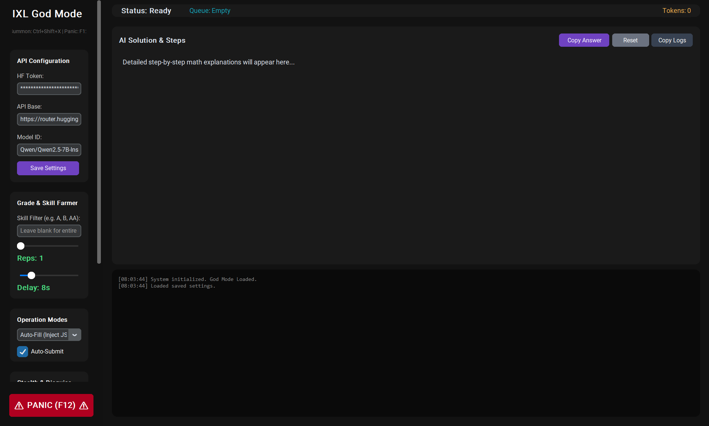
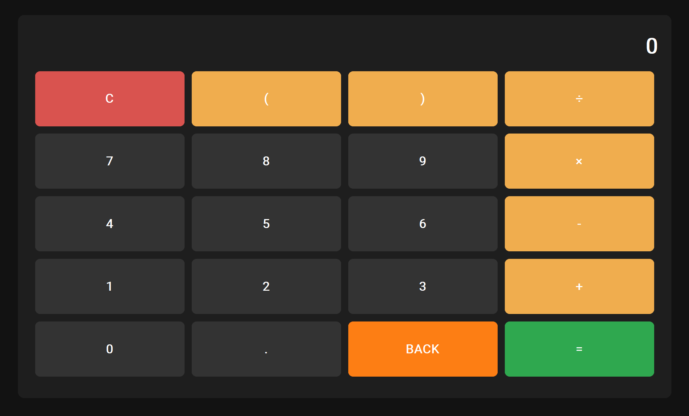

 

> **Automate the grind. Master the math. Stay invisible.**  
> A standalone, AI-driven web automation suite with stealth GUI, grade farming, and anti-detection.

[📥 Download Releases](#-download) · [✨ Features](#-features) · [⚙️ Setup](#-setup--configuration) · [🥷 Stealth](#-stealth--hotkeys) · [📖 Docs](#-documentation) · [🤝 Contributing](#-contributing) · [⭐ Support](#-support-the-project)

---

## 🎬 Preview

<i>The Main Automation Interface & Grade Farming Dashboard</i>

 

<i>Stealth Disguise Mode (Transforms into a fully working Calculator)</i>

---

## ✨ Features

### 🧠 Core Automation

| Feature | Description |
|---|---|
| AI-Powered Solving | Uses Hugging Face open-source models (Qwen, Llama, Mistral) to solve math step-by-step with explanations |
| Smart HTML Extraction | Sanitizes IXL's DOM, stripping hidden bloat to stay under AI token limits |
| Grade & Skill Farming | Scrapes entire grade pages and loops until "SmartScore 100" is achieved |
| Multiple Choice Support | Automatically detects and clicks IXL's SelectableTile divs and radio buttons |
| Event Dispatching | Bypasses IXL's anti-bot text field locks by simulating real human keystroke events |

### 🥷 Stealth & GUI

| Feature | Description |
|---|---|
| Disguise Mode | Instantly transforms the app into a fully working Calculator (supports exponents, parentheses, order of operations) |
| Taskbar Invisibility | Hides the app from Windows Taskbar and Alt-Tab switcher when Stealth Mode is enabled |
| Panic Protocol | Instantly vaporizes the app, browser, and all background processes with a single hotkey |
| Anti-Detection | Built on undetected-chromedriver to bypass basic webdriver fingerprinting |

### 🌐 Cross-Platform

| Platform | Support |
|---|---|
| 🪟 Windows | Standalone .exe (no setup or external dependencies required) |
| 🍎 Mac | One-click launcher script (Start_Mac.command) |
| 🐧 Linux | One-click launcher script (Start_Linux.sh) |

## 📥 Download

> ⚠️ Release files are located in the [Releases](https://github.com/mhmmmm000000/IXL-Auto-Answer-Bot/releases) tab, not in this repository root.

| Platform | File | Instructions |
|---|---|---|
| 🪟 Windows | \`IXL_Windows.exe\` | Double-click to run. (If Defender flags it: More Info → Run Anyway) |
| 🍎 Mac | \`Start_Mac.command\` | Right-click → Open → Open again on warning. Requires Chrome |
| 🐧 Linux | \`Start_Linux.sh\` | Right-click → Properties → Permissions → "Allow executing". Requires Chrome |

**Prerequisites for Mac/Linux:**
* Google Chrome installed

## ⚙️ Setup & Configuration

### 1. Get a Free API Token
* Go to [Hugging Face Token Settings](https://huggingface.co/settings/tokens)
* Create a free account → New Token → Role: Read → Generate
* Copy the \`hf_...\` token

### 2. Configure the App
* Launch the app for your platform
* Paste your token into the **HF Token** field
* Click **Save Settings** (it persists for next time)
* *(Optional)* Change Model ID to \`Qwen/Qwen2.5-7B-Instruct\` for best math performance

### 3. Launch & Automate
* Close all personal Chrome windows (critical for connection)
* Click **Launch Browser**
* Log into IXL manually in the opened window
* Navigate to a Grade page → Click **Farm Grade**, or go to a skill → Click **Finish Skill**

## 🥷 Stealth & Hotkeys

| Hotkey | Action | Description |
|---|---|---|
| \`F12\` | ⚠️ PANIC | Instantly kills browser, wipes session, force-closes app |
| \`Ctrl+Shift+X\` | 👻 Summon/Dismiss | Snaps window to center, or toggles Disguise Mode |
| \`Backspace\` | 🔙 Exit Calculator | When in Disguise Mode, returns to control panel |

### 🧮 Disguise Mode (Working Calculator)
Check **Disguise Mode** to hide the IXL interface and reveal a fully functional calculator:
* **Multiplication:** \`×\` button
* **Division:** \`÷\` button
* **Exponents:** Type \`^\` (e.g., \`2^3 = 8\`)
* **Order of Operations:** Use \`(\` and \`)\` buttons
* **Exit:** Click orange \`BACK\` button or press keyboard \`Backspace\`

## 📖 Documentation

For more in-depth information, check out these detailed guides:

* 📜 **[Changelog](https://github.com/mhmmmm000000/IXL-Auto-Answer-Bot/blob/main/CHANGELOG.md)** - See what's new in the latest versions.
* ❓ **[FAQ](https://github.com/mhmmmm000000/IXL-Auto-Answer-Bot/blob/main/FAQ.md)** - Frequently asked questions and common troubleshooting.
* 🛡️ **[Security Policy](https://github.com/mhmmmm000000/IXL-Auto-Answer-Bot/blob/main/SECURITY.md)** - Reporting vulnerabilities and security practices.
* 🤝 **[Contributing Guide](https://github.com/mhmmmm000000/IXL-Auto-Answer-Bot/blob/main/CONTRIBUTING.md)** - Detailed rules and setup for contributors.

## 🤝 Contributing
This project is open source and welcomes contributions! For full guidelines, read the **[Contributing Guide](https://github.com/mhmmmm000000/IXL-Auto-Answer-Bot/blob/main/CONTRIBUTING.md)**.

### 🐛 Found a Bug?
1. Go to the [Issues](https://github.com/mhmmmm000000/IXL-Auto-Answer-Bot/issues) tab
2. Click **New Issue**
3. Select the appropriate template (Bug Report / Feature Request)
4. Fill in details: OS, error logs, steps to reproduce
5. Submit! I'll review and respond ASAP.

### 💡 Want to Add a Feature?
1. Fork this repository
2. Create a new branch: \`git checkout -b feature/your-idea\`
3. Make your changes and commit: \`git commit -m "Add: your feature"\`
4. Push to your fork: \`git push origin feature/your-idea\`
5. Open a Pull Request and describe your changes

## ⭐ Support the Project
If you find this tool useful, please consider supporting development:

Ways to help:
* ⭐ **Star this repo** – Helps others discover it
* 👤 **Follow me on GitHub** – Get notified of updates
* 🔄 **Share with friends** – Spread the word
* 🐛 **Report issues** – Help me fix bugs

## ⚠️ Safety & Disclaimer
This software is an educational project designed to demonstrate web automation, DOM manipulation, and AI integration using Python and Selenium.

* This tool is not affiliated with, endorsed by, or sponsored by IXL Learning.
* Portions of the materials and logic interact with property owned by IXL Learning.
* This tool is not intended to interfere with IXL's services, disrupt educational experiences, or bypass classroom rules.
* The creator does not condone using this tool to gain unfair academic advantage.
* Any misuse is solely the responsibility of the user.
* Usage of automation tools can violate IXL's Terms of Service, which may lead to account suspension.

**Use at your own risk.**

  
Built with ❤️ and 🧠 
IXLAutoAnswerBot Project · <a href="https://github.com/mhmmmm000000/IXL-Auto-Answer-Bot/tree/main">GitHub</a> · <a href="https://github.com/mhmmmm000000/IXL-Auto-Answer-Bot/issues">Issues</a>

`;